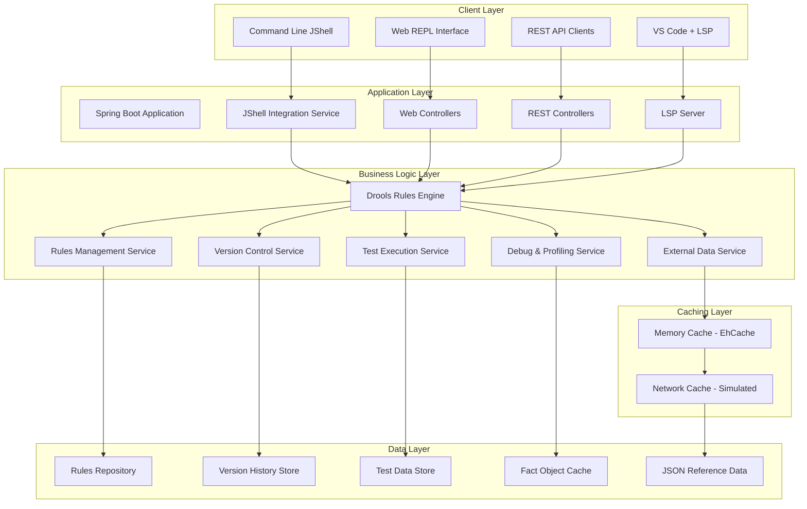
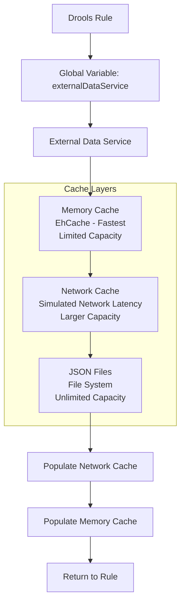

# Design Document

## Overview

The DMV Rules Engine is a sophisticated business rules management system built on Spring Boot, Drools, and JShell integration. The system provides multiple interfaces for rule development, testing, and execution: REST APIs for integration, web-based REPL for interactive development, command-line JShell access, and LSP support for IDE integration. The architecture emphasizes hot-reloading capabilities, version control, and comprehensive debugging tools to support dynamic rule development workflows.

## Architecture

### High-Level Architecture



### Core Components Architecture

The system follows a layered architecture with clear separation of concerns:

1. **Presentation Layer**: Multiple interfaces (CLI, Web, REST, LSP)
2. **Application Layer**: Spring Boot services coordinating business logic
3. **Business Logic Layer**: Drools engine with supporting services
4. **Data Layer**: Persistent storage for rules, versions, and test data

## Components and Interfaces

### 1. JShell Integration Service

**Purpose**: Provides interactive Java REPL environment with Drools integration

**Key Interfaces**:
```java
public interface JShellService {
    JShellSession createSession(String sessionId);
    ExecutionResult executeCode(String sessionId, String code);
    void preloadDroolsImports(JShellSession session);
    List<CompletionSuggestion> getCompletions(String sessionId, String partial);
    void destroySession(String sessionId);
}
```

**Implementation Details**:
- Maintains isolated JShell sessions per user/connection
- Pre-loads Drools classes and common imports
- Provides context-aware code completion
- Supports hot-reloading of rules without session restart
- Integrates with Spring application context for bean access

### 2. Rules Management Service

**Purpose**: Handles rule lifecycle, compilation, and hot-reloading

**Key Interfaces**:
```java
public interface RulesManagementService {
    RuleCompilationResult compileRule(String ruleContent);
    void deployRule(String ruleName, String ruleContent);
    void reloadAllRules();
    List<RuleMetadata> getLoadedRules();
    RuleExecutionResult executeRules(List<Object> facts);
    void removeRule(String ruleName);
}
```

**Implementation Details**:
- Dynamic rule compilation using Drools KieBuilder
- Hot-reloading without application restart
- Rule validation and error reporting
- Integration with version control system
- Thread-safe rule deployment and execution

### 3. LSP Server Implementation

**Purpose**: Provides Language Server Protocol support for IDE integration

**Key Interfaces**:
```java
public interface DroolsLSPServer extends LanguageServer {
    CompletableFuture<InitializeResult> initialize(InitializeParams params);
    void textDocumentDidOpen(DidOpenTextDocumentParams params);
    void textDocumentDidChange(DidChangeTextDocumentParams params);
    CompletableFuture<List<Diagnostic>> validateDocument(String uri);
    CompletableFuture<List<CompletionItem>> completion(CompletionParams params);
}
```

**Implementation Details**:
- Real-time syntax validation for .drl files
- Context-aware code completion
- Hover information for rule elements
- Integration with rules compilation service
- WebSocket-based communication with IDE extensions

### 4. Version Control Service

**Purpose**: Manages rule versioning, history, and rollback capabilities

**Key Interfaces**:
```java
public interface VersionControlService {
    RuleVersion saveRuleVersion(String ruleName, String content, String author);
    List<RuleVersion> getRuleHistory(String ruleName);
    RuleVersion rollbackToVersion(String ruleName, String versionId);
    RuleDiff compareVersions(String ruleName, String version1, String version2);
    void tagVersion(String ruleName, String versionId, String tag);
}
```

### 5. Test Execution Service

**Purpose**: Handles rule testing, simulation, and batch processing

**Key Interfaces**:
```java
public interface TestExecutionService {
    TestResult executeTestScenario(TestScenario scenario);
    BatchTestResult executeBatchTests(List<TestScenario> scenarios);
    SimulationResult simulateLoad(LoadTestConfig config);
    TestReport generateTestReport(List<TestResult> results);
}
```

### 6. External Data Service

**Purpose**: Provides multi-layer cached access to external reference data from JSON files, accessible to Drools rules via global variables

**Key Interfaces**:
```java
public interface ExternalDataService {
    List<Map<String, Object>> findByCollectionAndKey(String collection, String key, Object value);
    List<Map<String, Object>> findByCollection(String collection);
    void invalidateCache(String collection);
    void invalidateAllCaches();
    CacheStatistics getCacheStatistics();
}

public interface CacheLayer<K, V> {
    Optional<V> get(K key);
    void put(K key, V value);
    void invalidate(K key);
    void invalidateAll();
    CacheStats getStats();
}
```

**Multi-Layer Cache Architecture**:


**Implementation Details**:
- **Memory Cache**: EhCache-based, fastest access, limited capacity with LRU eviction
- **Network Cache**: In-memory simulation of network cache with configurable latency
- **JSON Storage**: File-based storage where filename = collection name
- **Cache Population**: Data flows back up the cache hierarchy when retrieved from lower layers
- **Global Variable Integration**: Registered as Drools global for rule access

## Data Models

### Core Domain Objects

```java
// DMV-specific fact objects
public class LicenseRenewalRequest {
    private String applicantId;
    private PersonalInfo personalInfo;
    private LicenseInfo currentLicense;
    private List<Violation> violations;
    private RenewalType renewalType;
    // getters/setters
}

public class PersonalInfo {
    private String firstName;
    private String lastName;
    private LocalDate dateOfBirth;
    private Address address;
    private String phoneNumber;
    // getters/setters
}

public class LicenseInfo {
    private String licenseNumber;
    private LicenseClass licenseClass;
    private LocalDate issueDate;
    private LocalDate expirationDate;
    private LicenseStatus status;
    // getters/setters
}

public class RenewalDecision {
    private DecisionType decision; // APPROVED, REJECTED, REQUIRES_ACTION
    private List<String> requirements;
    private List<String> reasons;
    private BigDecimal fee;
    private LocalDate validUntil;
    // getters/setters
}
```

### Rule Management Objects

```java
public class RuleMetadata {
    private String ruleName;
    private String description;
    private LocalDateTime lastModified;
    private String author;
    private RuleStatus status;
    private List<String> tags;
    // getters/setters
}

public class RuleVersion {
    private String versionId;
    private String ruleName;
    private String content;
    private LocalDateTime timestamp;
    private String author;
    private String commitMessage;
    // getters/setters
}
```

### Test and Debug Objects

```java
public class TestScenario {
    private String scenarioName;
    private String description;
    private List<Object> inputFacts;
    private List<ExpectedOutcome> expectedOutcomes;
    // getters/setters
}

public class ExecutionTrace {
    private List<RuleFiring> ruleFirings;
    private List<FactModification> factModifications;
    private Map<String, Object> performanceMetrics;
    private long executionTimeMs;
    // getters/setters
}
```

### External Data Service Objects

```java
public class CacheStatistics {
    private String cacheName;
    private long hitCount;
    private long missCount;
    private double hitRatio;
    private long evictionCount;
    private long size;
    private long maxSize;
    // getters/setters
}

public class ExternalDataQuery {
    private String collection;
    private String key;
    private Object value;
    private Map<String, Object> filters;
    private int limit;
    private int offset;
    // getters/setters
}

public class CacheConfiguration {
    private String name;
    private int maxEntries;
    private long timeToLiveSeconds;
    private long timeToIdleSeconds;
    private boolean eternal;
    private EvictionPolicy evictionPolicy;
    // getters/setters
}

public class NetworkCacheSimulation {
    private long baseLatencyMs;
    private long varianceMs;
    private double failureRate;
    private boolean enabled;
    // getters/setters
}
```

## Error Handling

### Error Categories and Strategies

1. **Rule Compilation Errors**
   - Syntax errors in .drl files
   - Missing fact class references
   - Invalid rule conditions
   - Strategy: Detailed error messages with line numbers and suggestions

2. **Runtime Execution Errors**
   - Fact object validation failures
   - Rule execution exceptions
   - Memory constraints
   - Strategy: Graceful degradation with fallback rules

3. **JShell Integration Errors**
   - Code compilation failures
   - Session timeout issues
   - Resource exhaustion
   - Strategy: Session isolation and automatic cleanup

4. **LSP Communication Errors**
   - WebSocket connection failures
   - Protocol version mismatches
   - IDE extension compatibility
   - Strategy: Robust reconnection and version negotiation

### Error Response Format

```json
{
  "error": {
    "code": "RULE_COMPILATION_ERROR",
    "message": "Syntax error in rule 'AgeVerification'",
    "details": {
      "line": 15,
      "column": 23,
      "suggestion": "Expected 'then' keyword after rule condition"
    },
    "timestamp": "2024-10-30T10:30:00Z"
  }
}
```

## Testing Strategy

### Unit Testing Approach

1. **Rule Logic Testing**
   - Individual rule validation with mock facts
   - Edge case scenario testing
   - Performance benchmarking for complex rules

2. **Service Layer Testing**
   - JShell service integration tests
   - Rules management service tests
   - Version control service tests

3. **Integration Testing**
   - End-to-end rule execution workflows
   - REST API integration tests
   - LSP protocol compliance tests

### Test Data Management

- **Sample DMV Scenarios**: Realistic test cases covering common renewal situations
- **Edge Cases**: Boundary conditions, invalid data, system limits
- **Performance Tests**: Load testing with concurrent rule executions
- **Regression Tests**: Automated validation of rule behavior across versions

### Testing Tools and Frameworks

- **JUnit 5**: Core testing framework
- **Testcontainers**: Integration testing with embedded services
- **WireMock**: External service mocking
- **JMeter**: Performance and load testing
- **Custom Rule Testing DSL**: Domain-specific testing language for rule scenarios

## Performance Considerations

### Optimization Strategies

1. **Rule Engine Optimization**
   - Rule indexing for faster pattern matching
   - Fact caching to reduce object creation overhead
   - Parallel rule execution for independent rule sets

2. **JShell Performance**
   - Session pooling to reduce startup overhead
   - Code compilation caching
   - Memory management for long-running sessions

3. **LSP Responsiveness**
   - Incremental compilation for large rule files
   - Background validation to avoid blocking UI
   - Efficient diff algorithms for change detection

4. **External Data Service Performance**
   - Multi-layer caching with EhCache for optimal memory management
   - Asynchronous cache warming for frequently accessed collections
   - Batch loading strategies for large JSON files
   - Configurable cache eviction policies (LRU, LFU, TTL)
   - Network cache simulation with realistic latency modeling

### Scalability Considerations

- **Horizontal Scaling**: Stateless service design for load balancing
- **Caching Strategy**: Redis integration for distributed rule caching
- **Database Optimization**: Indexed queries for rule and version retrieval
- **Resource Management**: Configurable limits for concurrent sessions and rule executions

## Security Considerations

### Authentication and Authorization

1. **API Security**
   - JWT token-based authentication for REST endpoints
   - Role-based access control (RBAC) for rule management
   - API rate limiting to prevent abuse

2. **JShell Security**
   - Sandboxed execution environment
   - Restricted class access and imports
   - Session timeout and cleanup policies

3. **LSP Security**
   - Secure WebSocket connections (WSS)
   - Client certificate validation
   - Encrypted communication channels

### Code Execution Safety

- **JShell Sandboxing**: Restricted access to system resources
- **Rule Validation**: Static analysis to prevent malicious rule content
- **Resource Limits**: Memory and CPU constraints for rule execution
- **Audit Logging**: Comprehensive logging of all rule modifications and executions

### External Data Service Security

- **File Access Control**: Restricted access to designated JSON data directories
- **Input Validation**: Sanitization of collection names and query parameters
- **Cache Isolation**: Separate cache namespaces for different tenants/contexts
- **Data Integrity**: Checksums and validation for JSON file contents
- **Access Auditing**: Logging of all external data access patterns and cache operations